

  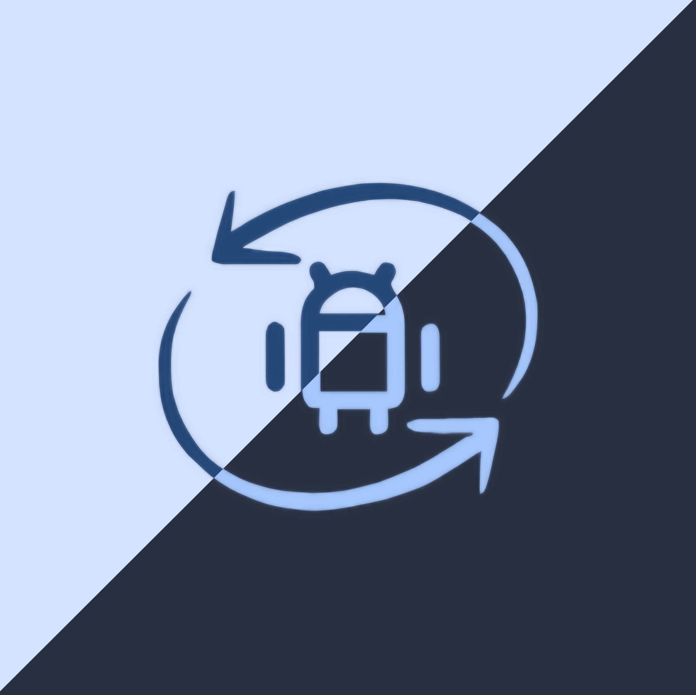

<h1 align="center">⚡ QuickSE: Monet</h1>

  🔐 <i>Instantly check & toggle SELinux status on rooted Android devices... with a bit of a re-color touch.</i> 

  
  
  

  

  
  
  

  
  

---

## 📱 What is QuickSE: Monet?

**QuickSE: Monet** is a fork of **QuickSE** , a lightweight, open-source Android app that allows rooted users to **view**, **toggle**, and **automatically set** SELinux mode between **Enforcing** and **Permissive**. **QuickSE: Monet** adds a Material You interface.

Built with **Jetpack Compose** and **Kotlin**, it offers a fast, clean, and intuitive experience with just the essential tools you need.

---

<h2 align="center">📸 Screenshots</h2>

  <table>
    <tr>
      <td align="center">
        <b>🌞 Light Mode</b> 
        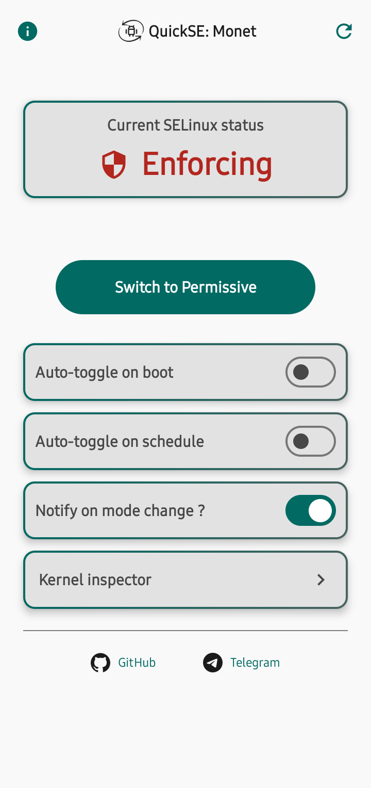 
        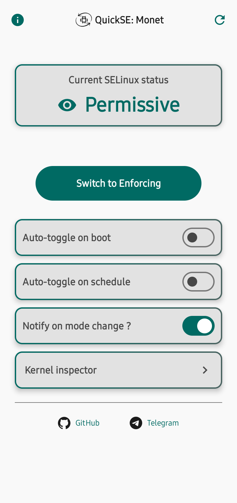
        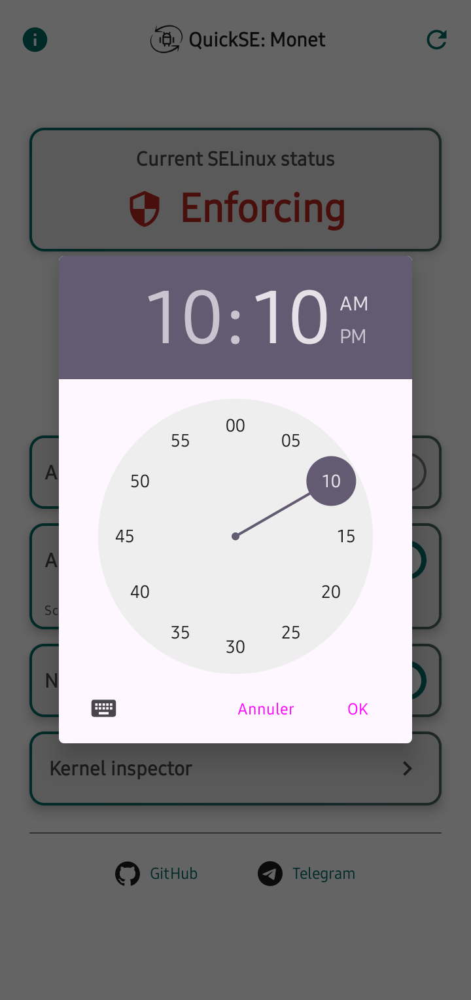
        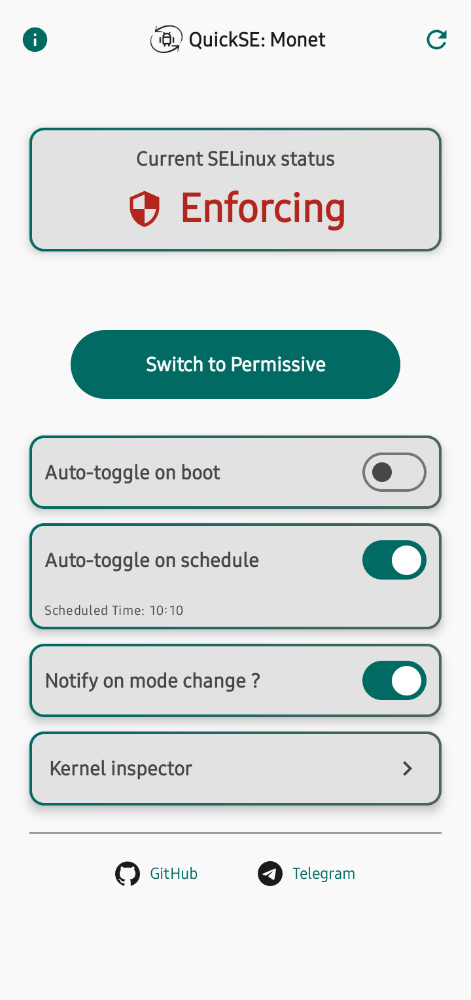
        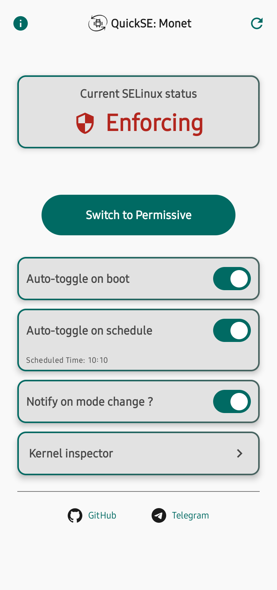
        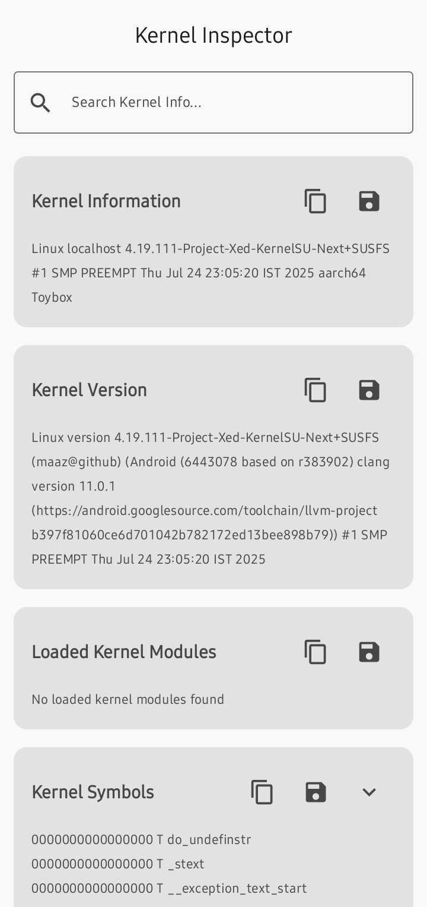
      </td>
      <td align="center" style="padding-left: 40px;">
        <b>🌙 Dark Mode</b> 
         
        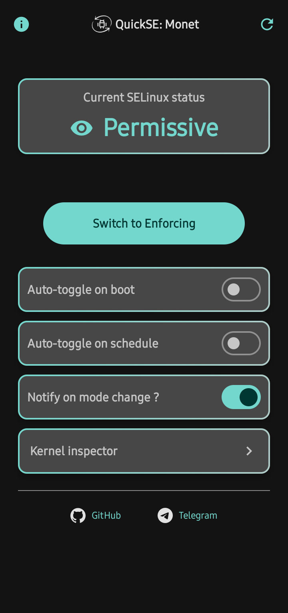
        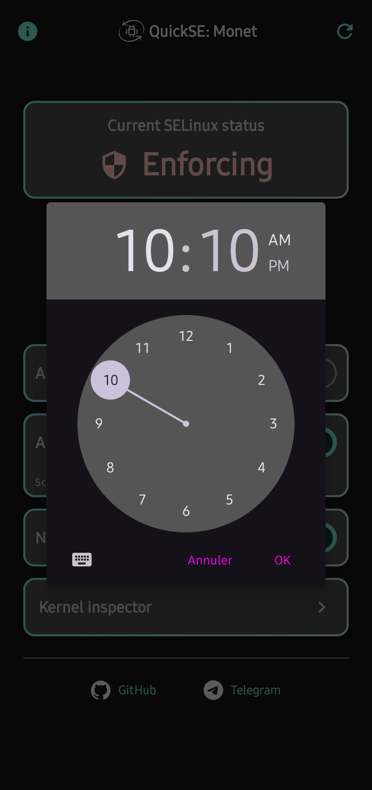
        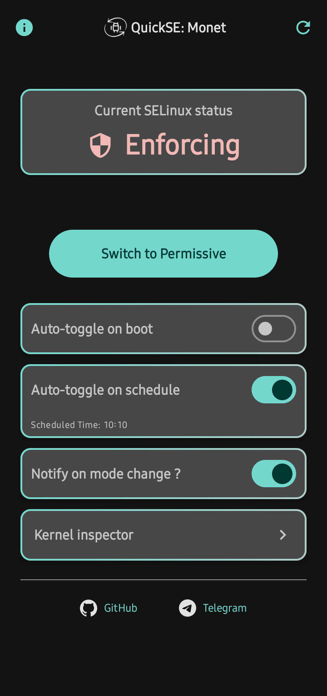
        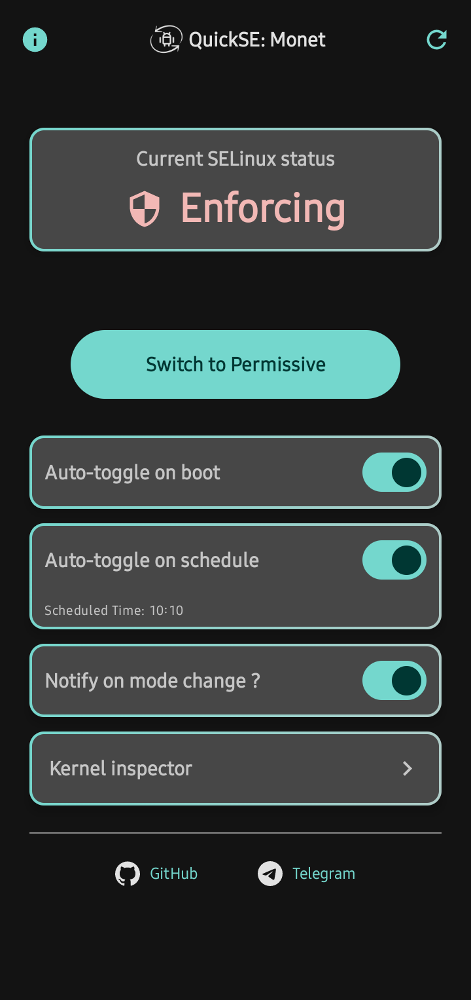
        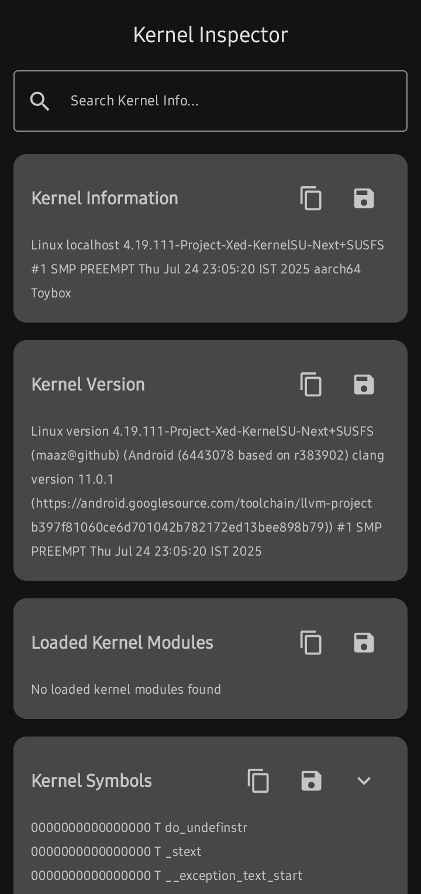
      </td>
    </tr>
  </table>

---

## ⚙️ Requirements

- 📱 Android 12+ (API 31 or higher)
- 🔓 Root access (required to change SELinux mode)

---

> ⚠️ SELinux mode resets on reboot unless you enable auto-toggle.

---

## ⬇️ Download

- 👉 [**Go to Releases page**](https://github.com/meafrenchdude/QuickSE-Monet/releases)

---

## 📄 License

This project is licensed under the [GNU GPLv3](LICENSE).  
You are free to use, modify, and distribute it under the terms of the license.

---

## 📬 Contact / Support

💬 Questions or suggestions?  
Stay tuned for the next updates on the Telegram channel: [@QuickSE_Monet](https://t.me/QuickSE_Monet)   
Reach out on the Telegram group: [@QuickSE_Monet_Chat](https://t.me/QuickSE_Monet_Chat)

---

## 🌟 Original Project

  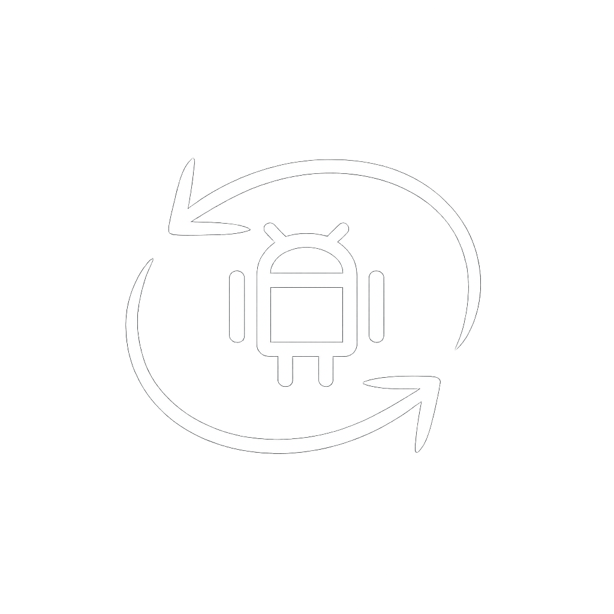

[**QuickSE**](https://github.com/maazm7d/QuickSE) was made by [<i>**maazm7d**<i>](https://github.com/maazm7d).
